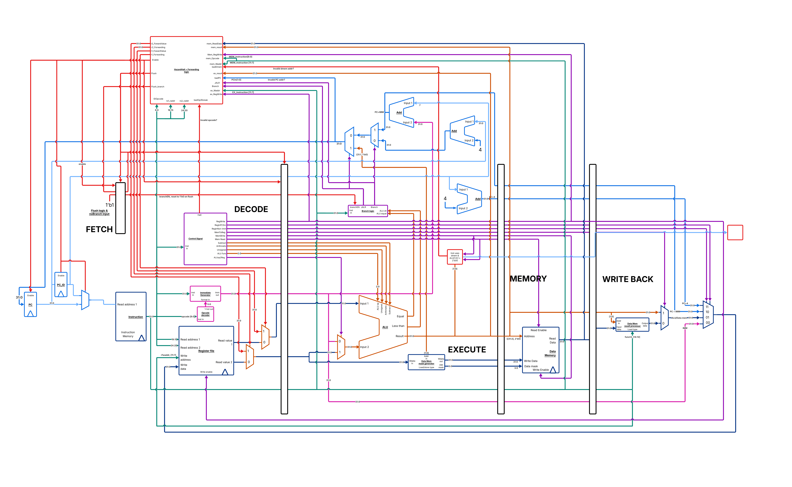

# Pipelined RISC-V Processor
 
A 32-bit pipelined RISC-V processor implemented in Verilog, designed and verified as part of a computer architecture course at UW-Madison. Scored 220/200 — full marks plus 20 extra credit points for successful FPGA deployment.
 
## Architecture
 

 
The processor implements the RV32I base integer instruction set using a classic 5-stage pipeline:
 
1. **IF** — Instruction Fetch
2. **ID** — Instruction Decode & Register Read
3. **EX** — Execute (ALU operations, branch resolution)
4. **MEM** — Data Memory Access
5. **WB** — Write Back
## Features
 
- Full RV32I instruction set support including R, I, S, B, U, and J type instructions
- Pipelined execution with pipeline registers between every stage
- **Hazard detection and data forwarding** — handles RAW hazards via EX-EX and MEM-EX forwarding paths, eliminating unnecessary stalls for most instructions
- **Load-use stall detection** — automatically stalls the pipeline when a load result is needed immediately by the following instruction
- **Branch resolution and pipeline flush** — branch and jump targets resolved in the EX stage with delayed flush logic to squash incorrectly fetched instructions
- Byte and halfword memory access support with data memory mask generation
- Misaligned memory access detection with trap signaling
- Reset delay chain to prevent false trap signals at startup
- Complete instruction retire interface for testbench verification
- Successfully synthesized and deployed on a Xilinx FPGA
## Module Structure
 
| Module | Description |
|--------|-------------|
| `hart.v` | Top-level processor module, pipeline instantiation |
| `alu.v` | Arithmetic Logic Unit — add/sub, shifts, logic, comparisons |
| `hazardHalt.v` | Hazard detection, data forwarding, stall and flush control |
| `branchControl.v` | Branch condition evaluation and jump detection |
| `generalControl.v` | Main control signal decoder |
| `imm.v` | Immediate value generator for all instruction formats |
| `rf.v` | 32-entry register file with synchronous write, async read |
| `DMMask.v` | Data memory write mask and data alignment |
| `DMresult.v` | Data memory read result sign/zero extension |
| `pc.v` | Program counter register |
| `opcodeDecoder.v` | 1-hot instruction format encoder |
| `mux2.v`, `mux4.v` | 2:1 and 4:1 multiplexers |
| `dff_*.v` | Parameterized D flip-flop pipeline register primitives |
 
## Tools
 
- **Simulation:** Questasim / Modelsim
- **Synthesis & FPGA:** Vivado, Quartus
- **Language:** Verilog
## Notes
 
This was the final phase of a multi-phase processor project, building up from a single-cycle implementation to a fully pipelined design. A cache unit was developed separately but is not included here as it was not fully integrated into the final submission.
